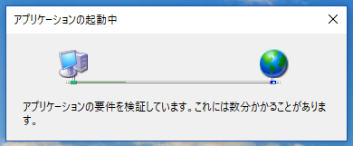

### pyautoguiでお手軽業務RPAしてみた

Unagi.py 勉強会16枚目 LT

Hiroshi Sano

---

### お前誰よ

[](https://twitter.com/hrs_sano645)

- 本業:自動車プレス金型の設計 [佐野設計事務所](https://sano-design.info)
	- 設計以外の全て担当
- 時々[東海大学 石井研究室](https://ishiilab.net) のお手伝い
- 最近は雑務を極力Python（マシン）に投げまくってる

---

### 本業でよくやること

- 機械の設計 -> いろんな部品を扱う
- 3D CADでモデリングする -> 3Dで扱う部品のデータをメーカーのサイトでDL
  - 共通のリポジトリとかもあります([PartCommunity](https://web2cad.partcommunity.com/3d-cad-models/)とか)

面倒なので自動化したい

---

### WEB スクレイピングでよくない？

- 大抵はそれでおk
    - 簡易なWEBサイトが結構多い: requests+BS4とか
    - selenium-python + webdriver（headless chrome, Firefox, Edgeとか）
- そうもいかない場所
    - ActiveXとかはもうさすがに無いよね？
    - 特殊なプログラムを扱うようなもの(専用のダウンローダーが動くやつ）

---

### 例えばこういうの面倒



[ClickOnce](https://ja.wikipedia.org/wiki/ClickOnce) という技術で、WEBから.NETプログラムが動かせるらしいです。

WEBスクレイピング系のライブラリだとブラウザより先はカバーできない

---

#### そこでRPAという救世主が！！


---

#### RPA(Robotics Process Automation）とは

```
ロボティック・プロセス・オートメーション
（英: robotic process automation、RPA）とは、
認知技術（ルールエンジン・機械学習・人工知能等）を活用した、
主にホワイトカラー業務の効率化・自動化の取組みである。
人間の補完として業務を遂行できることから、仮想知的労働者[1]とも言われている[2]。
また、デスクトップ作業のみに絞ったものをロボティック・デスクトップ・オートメーションと呼び、
RPAと区別することもある[3]。

by wikipedia
```

---

### RPA期待高い話多い

- [なんと平均約85%の効率化？！自治体のRPA実証実験で驚愕の結果が【iNTERNET magazine Reboot】 - INTERNET Watch](https://internet.watch.impress.co.jp/docs/imreboot/news/1177196.html)
- [ Apple、イタリアのRPA企業Stamplayを買収 - ITmedia NEWS](https://www.itmedia.co.jp/news/articles/1903/22/news075.html)
- [Google トレンドで「RPA, ロボティック・プロセス・オートメーション - すべての国、2016/03/02～2019/04/02」の 人気度の動向 を見る](https://trends.google.co.jp/trends/explore/TIMESERIES/1554183000?hl=ja&tz=-540&date=2016-03-02+2019-04-02&q=RPA,%2Fg%2F11c3p_5fs0&sni=3)

---

### RPAのいいところ悪いところ

いいところ

- 単純に時間の節約につながる
- 作業=コードやフローにできて明文化できる
- 人が関与しなくて良いので品質、信頼性につながる

---

### RPAのいいところ悪いところ

悪いところ

- 複雑なものを単純にするのは難しい
- マシンでできない作業はできない（印鑑押すとか

---

### pyautogui使ってみた

こちらです

-> [PyAutoGUI · PyPI](https://pypi.org/project/PyAutoGUI/)

簡単に言うと GUIでの操作をオートメーションするためのライブラリ

---

### pyautoguiの使い方:インストール

```bash
pip install pyautogui

#pipenvなら
pipenv install pyautogui
```

```python
>>> import pyautogui
# ディスプレイの解像度
>>> screenWidth, screenHeight = pyautogui.size()
# 実行したタイミングでのマウスの位置座標
>>> currentMouseX, currentMouseY = pyautogui.position()
```

---

### マウスの操作

```python
# 移動
>>> pyautogui.moveTo(100, 200)   # moves mouse to X of 100, Y of 200.
>>> pyautogui.moveTo(None, 500)  # moves mouse to X of 100, Y of 500.
>>> pyautogui.moveTo(600, None)  # moves mouse to X of 600, Y of 500.
# 現在の位置をクリック
>>> pyautogui.click()  # click the mouse

# 移動してクリック
>>> pyautogui.click(x=100, y=200)
```

---

### キーボード操作

```python
# 文字入力（日本語やったこと無いけど多分だめ。IMEのモード入れてローマ字）
>>> pyautogui.typewrite('Hello world!')

# 特殊キーもいけます
>>> pyautogui.press('enter')  # press the Enter key
>>> pyautogui.press('f1')     # press the F1 key
>>> pyautogui.press('left')   # press the left arrow key

# keyup, key,down, でキーを押して話すも再現

# hotkey
>>> pyautogui.hotkey('ctrl', 'shift', 'esc')
```

---

### 画像識別で位置推定

```python
>>> pyautogui.locateOnScreen('求めたい位置の画像.png')
(863, 417, 70, 13) # マッチした位置の 右上x,y, 幅, 高さ

```

---

### スクリーンショット

自動化→自動テスト ~~/エクセルエビデンス~~ の状況把握の際に

```python
>>> im1 = pyautogui.screenshot()
>>> im2 = pyautogui.screenshot('my_screenshot.png')
```

~~openpyxlを使えばエビデンスのSSコピペも自動に作れそう~~

---

### 使う時の勘所

とにかくディスプレイの座標が非常に重要

- ウィンドウが被ると失敗する問題
    - win32gui(pywin32)でウィンドウの情報取得と座標の計算が必須
    - 被らないような工夫（バックグラウンドとフォアグラウンドを正しく把握する手段）
- ショートカットキーが使えると正確性高くなる
- 画像識別での座標検出は精度良くない（使いこなせてないからかも）

---

### 実際の例

（用意できたら）

---

# まとめ

---

自動化万歳！コード化万歳！

他のライブラリと組み合わせれば強みでます。

マシンにさせれることはさせましょう ;)

---

本当はAPI叩いてDLできればいいのに！

(ヽ´ω`)

---
### そのほかのRPAツール

たくさんありすぎて、よく把握できてません...

色々あるからググってくださいw
